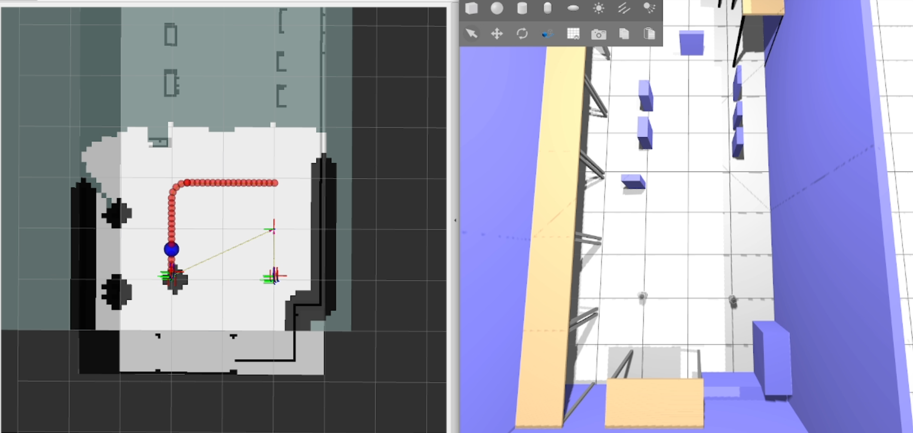

# Robot Fleet Navigation System for Product Logistics

A bachelor's thesis project developed at **Poznan University of Technology**.  
This system implements a multi-robot navigation and coordination framework for autonomous logistics in industrial and simulated environments.

---

## Project Overview

The goal of this project is to design and implement a fleet navigation system for mobile robots using ROS 2, Gazebo, and Nav2. The system includes:

- Virtual and real robot modeling (URDF, Gazebo)
- Sensor simulation (LiDAR, camera)
- Localization (AMCL) and mapping (SLAM with EKF)
- Path planning (A* algorithm with motion primitives)
- Multi-robot coordination in industrial and lab environments

The robot platform used is **MTracker**, a differential-drive mobile robot developed at the Department of Control and Systems Engineering.

---

## Technologies & Tools

- **ROS 2 Humble**
- **Gazebo** (simulation environment)
- **RViz2** (visualization)
- **Nav2** (navigation stack)
- **tf2** (transform library)
- **URDF** (robot modeling)
- **Python**

---

## Project Structure

```
robot_fleet/
├── src/
│   ├── project_description/       # URDF, meshes, world files
│   ├── project_controller/        # Navigation, control nodes
│   ├── project_localization/      # AMCL configuration
│   └── project_master/            # Master coordination node
```

---

## How to Run the Project

### 1. Build the workspace

```bash
colcon build
```

### 2. Source the setup file in each new terminal

```bash
. install/setup.bash
```

### 3. Launch the simulation world

```bash
ros2 launch project_description world.launch.py
```

### 4. Launch navigation for robot 1

```bash
ros2 launch project_controller navigation_custom_launch.py \
  map:=./src/project_controller/maps/nasz_swiat.yaml \
  use_sim_time:=true \
  params_file:=./src/project_controller/config/nav2_params.yaml
```

### 5. Launch navigation for robot 2

```bash
ros2 launch project_controller navigation_custom_launch.py \
  map:=./src/project_controller/maps/nasz_swiat.yaml \
  use_sim_time:=true \
  params_file:=./src/project_controller/config/nav2_params_robot2.yaml \
  robot_id:=2
```

### 6. Launch localization (AMCL)

```bash
ros2 launch project_localization localization_launch.py
```

### 7. Launch the controller

```bash
ros2 launch project_controller controller.launch.py
```

### 8. Run the master coordination node

```bash
ros2 run project_master master.py
```

---

## System Preview



---

## References

[1] S. Thrun, W. Burgard, and D. Fox, *Probabilistic Robotics*. MIT Press, 2005.

[2] T. Mańkowski, "mtracker: ROS packages for the mTracker mobile robot," GitHub repository, 2024. [Online]. Available: https://github.com/tysik/mtracker

[3] Wikipedia contributors, "List of moments of inertia," Wikipedia, The Free Encyclopedia, 2026. [Online]. Available: https://en.wikipedia.org/wiki/List_of_moments_of_inertia

[4] Automatic Addison, "Yahboom Rosmaster LiDAR URDF," GitHub repository, 2021. [Online]. Available: https://github.com/automaticaddison/yahboom_rosmaster/blob/main/yahboom_rosmaster_description/urdf/sensors/lidar.urdf.xacro

[5] Open Robotics, "tf2 — ROS 2 Documentation (Foxy)," 2024. [Online]. Available: https://docs.ros.org/en/foxy/Tutorials/Intermediate/Tf2/Tf2-Main.html

[6] ROS Wiki, "Unified Robot Description Format (URDF)," 2026. [Online]. Available: https://wiki.ros.org/urdf

[7] R. M. Sobański, M. M. Michałek, and M. Defoort, "Predefined-time VFO control design for unicycle-like mobile robots," *Nonlinear Dynamics*, vol. 112, no. 8, pp. 6389–6408, 2024. doi: 10.1007/s11071-024-09355-w

[8] M. M. Michałek, M. Kiełczewski, and T. Jedwabny, "Cascaded VFO control for non-standard N-trailer robots," *Journal of Intelligent & Robotic Systems*, vol. 77, pp. 415–432, 2015. doi: 10.1007/s10846-013-9981-z

[9] A. Brandi, "Self-Driving and ROS 2: Learn by Doing - Odometry & Control," GitHub repository. [Online]. Available: https://github.com/AntoBrandi/Self-Driving-and-ROS-2-Learn-by-Doing-Odometry-Control

---

## Authors

- **Makary Kaczmarek** (155197)
- **Franciszek Kozanecki** (155048)
- **Miłosz Roszyk** (155121)

**Supervisor:** PhD, Eng Marcin Kiełczewski

**Field of study:** Automation and Robotics
**University:** Poznan University of Technology
**Institute:** Automation and Robotics and Electrical Engineering
**Division:** Control and Robotics

---

## License

This project is developed as part of a bachelor’s thesis at Poznan University of Technology.  
All rights reserved by the authors and the institute.

---

## Contact

For questions or collaboration, please contact the authors via institutional email or open an issue in the repository.
